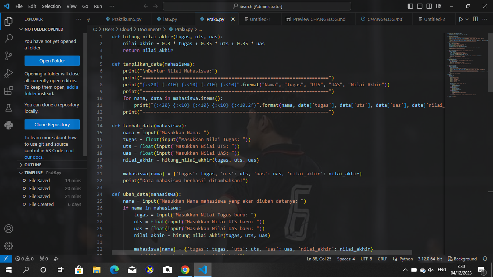
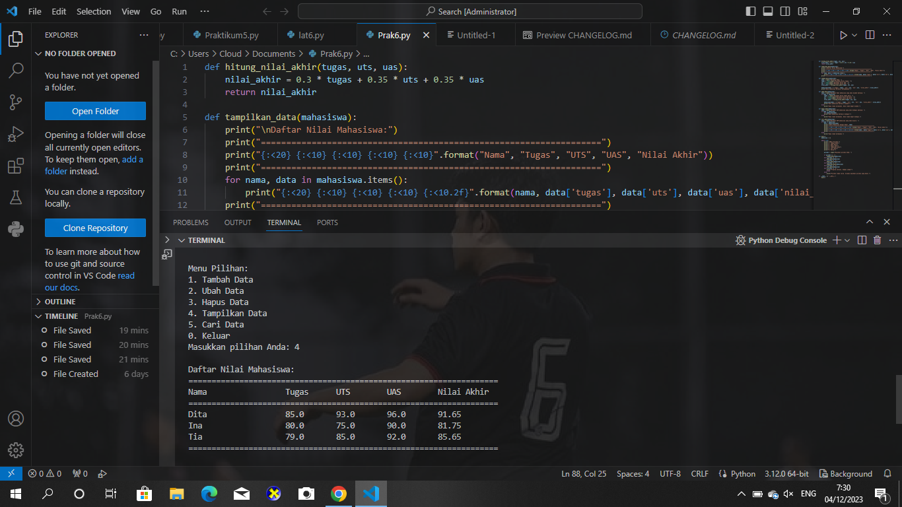
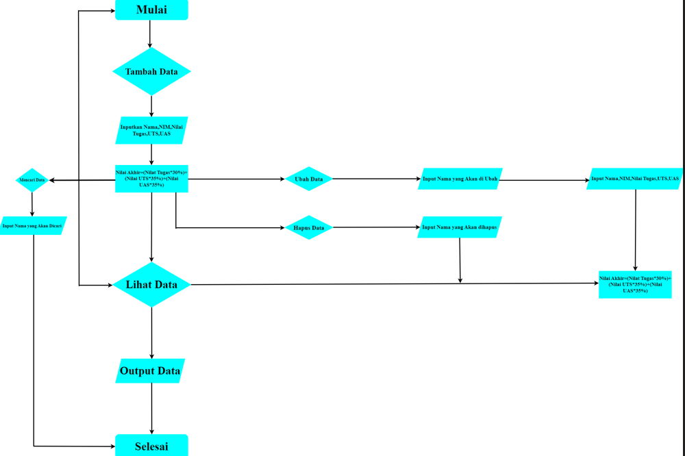

# LANGKAH-LANGKAH LATIHAN

1. Mengimport lambang yang akan digunakan

2. Masukkan contoh penggunaan dari setiap lambang yang sudah dibuat

3. Print data yang sudah di buat

4. Lalu run file agar hasilnya terlihat

# Latihan

.png)

# Praktikum 6

.png)

.png)

# FLOWCHART

